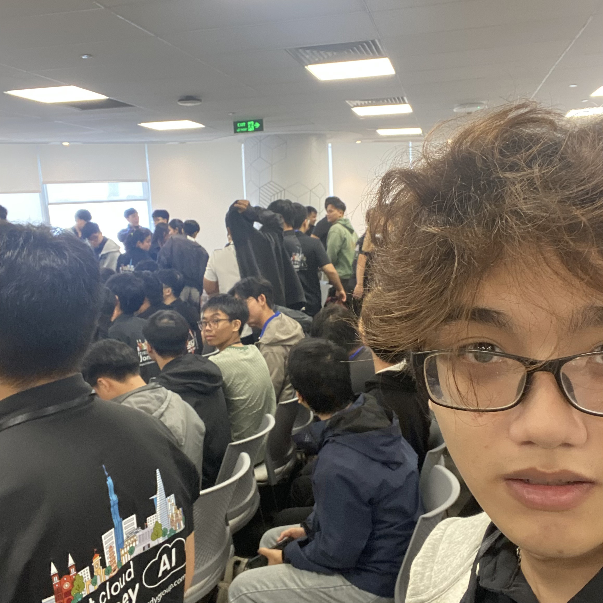

# Bài thu hoạch “Buildrathon Kickoff: Code the Future with CMC Global”

### Mục Đích Của Sự Kiện

- Khởi động cuộc thi/thử thách công nghệ Buildathon do CMC Global phối hợp cùng đối tác tổ chức.
- Giới thiệu và định hướng các công nghệ tiên phong: AWS Cloud, Generative AI, và đặc biệt là Agentic AI (AI Agent).
- Hướng dẫn thực hành trực tiếp các kỹ thuật xây dựng AI trên hạ tầng AWS (Prompt Engineering, RAG, Knowledge Bases).
- Kết nối cộng đồng công nghệ, định hướng lộ trình phát triển sự nghiệp và hỗ trợ chuẩn bị phỏng vấn trong lĩnh vực Cloud & AI.

### Danh Sách Diễn Giả

- **Truong Bui** - Tech Lead CMC Global
- **Thien Lu** - Program Manager FCAJ
- **Phong Pham** - Program Manager FCAJ

### Nội Dung Nổi Bật

#### Giới Thiệu Cuộc Thi Buildathon & Xu Hướng AI Agent

- Giới thiệu tổng quan về thể lệ, cơ cấu giải thưởng và tiêu chí đánh giá của cuộc thi Buildathon.
- Khái niệm Agentic AI: Chuyển đổi từ mô hình Generative AI thông thường (chỉ trả lời văn bản) sang AI Agent có khả năng tự suy luận, lập kế hoạch và thực thi tác vụ.
- Kiến trúc tổng quan khi xây dựng và triển khai AI Agent trên hệ sinh thái AWS Cloud.

#### Giao Lưu & Lập Đội (Ice-breaking)

- Hoạt động kết nối các cá nhân tham gia để tìm kiếm đồng đội có kỹ năng bù trừ (Frontend, Backend, Cloud, Data/AI).
- Thảo luận nhanh về ý tưởng đề xuất cho cuộc thi dưới sự tham góp ý ban đầu từ đội ngũ Mentor.

#### Talkshow: Building a Career in Cloud & AI

- Phân tích bức tranh thị trường lao động và xu hướng tuyển dụng nhân sự Cloud & AI hiện nay.
- Lộ trình phát triển bản thân: Từ kiến thức nền tảng đến các chứng chỉ chuyên môn của AWS (AWS Certified Solutions Architect, AWS Certified AI Practitioner,...).
- Chia sẻ kinh nghiệm thực chiến từ các chuyên gia khi làm việc trong các dự án Cloud/AI quy mô toàn cầu tại CMC Global.

#### Phiên Hỏi Đáp (Q&A Session)

- Giải đáp chi tiết các thắc mắc về kỹ thuật khi làm việc với các dịch vụ AI/ML của AWS.
- Cung cấp thông tin chi tiết về các vòng thi tiếp theo của Buildathon và các tiêu chí chấm điểm kỹ thuật.

#### Thực Hành Trực Tiếp (Hands-on - AI Agent Challenge)

- **Prompt Engineering:** Phương pháp tối ưu câu lệnh để AI trả ra kết quả chính xác và đúng định dạng yêu cầu.
- **RAG (Retrieval-Augmented Generation):** Tích hợp dữ liệu riêng của doanh nghiệp/người dùng vào mô hình AI để tránh hiện tượng "ảo giác" (hallucination).
- **AWS Knowledge Bases:** Sử dụng dịch vụ lưu trữ và truy xuất tri thức tự động trên AWS để xây dựng bộ nhớ cho AI Agent.
- Thực hành dựng một **AI Agent mini** hoàn chỉnh ngay tại workshop dưới sự hỗ trợ 1-on-1 của Mentor.

#### Phỏng Vấn Thử (Mock Interview Session)

- Mô phỏng quy trình phỏng vấn thực tế cho các vị trí: Cloud Engineer, DevOps Engineer, Data Engineer, Solution Architect.
- Nhận phản hồi trực tiếp (feedback) từ các chuyên gia tuyển dụng và kĩ thuật về điểm mạnh, điểm cần cải thiện trong cả CV lẫn kỹ năng trả lời phỏng vấn.

### Những Gì Học Được

#### Tư Duy & Kiến Thức Công Nghệ

- **Chuyển dịch tư duy AI:** Nắm rõ sự khác biệt giữa Chatbot truyền thống và AI Agent có khả năng tự động hóa quy trình kinh doanh.
- **Kiến trúc RAG thực tế:** Hiểu cách kết hợp giữa Vector Database, LLMs và dữ liệu doanh nghiệp để tạo ra các giải pháp AI an toàn và chính xác.
- **Lựa chọn dịch vụ Cloud phù hợp:** Biết cách kết hợp các dịch vụ trên AWS để tối ưu chi phí và hiệu năng khi vận hành mô hình AI.

#### Kỹ Năng Thực Hành Kỹ Thuật

- Khả năng tự thiết kế các luồng xử lý (workflows) cho AI Agent trên AWS.
- Kỹ năng cấu hình **Knowledge Bases** và kết nối nguồn dữ liệu đầu vào chuẩn xác.
- Cách viết Prompt tối ưu cho các bài toán phức tạp đòi hỏi suy luận nhiều bước.

#### Định Hướng Nghề Nghiệp

- Hiểu rõ tiêu chuẩn đánh giá ứng viên của các tập đoàn công nghệ lớn như CMC Global.
- Nhận diện được khoảng trống kiến thức (gap analysis) của bản thân thông qua phiên Mock Interview để lên kế hoạch học tập bổ sung.

### Ứng Dụng Vào Công Việc

- **Tham gia cuộc thi Buildathon:**  Hoàn thiện ý tưởng bài thi cùng đồng đội dựa trên các kiến thức RAG và AI Agent đã tiếp thu.
- **Áp dụng AI Agent vào dự án:** Nghiên cứu đưa AI Agent vào tự động hóa các quy trình hỗ trợ nội bộ hoặc chăm sóc khách hàng.
- **Tối ưu hóa workflow phát triển:** Sử dụng kiến thức AWS Cloud để đóng gói và triển khai ứng dụng AI nhanh chóng hơn.   
- **Chuẩn bị hành trang sự nghiệp:** Cập nhật lại CV, bổ sung các dự án AI/Cloud thực chiến và đăng ký thi các chứng chỉ AWS phù hợp.

### Trải nghiệm trong event

Tham gia sự kiện **Buildrathon Kickoff: Code the Future with CMC Global** tại tòa nhà Bitexco là một trải nghiệm cực kỳ năng động và mang lại nhiều giá trị thực tế cho lộ trình phát triển bản thân. Một số điểm nhấn đáng nhớ:

#### Không khí công nghệ và cơ hội kết nối rộng mởHọc hỏi từ các diễn giả có chuyên môn cao
- Sự kiện quy tụ đông đảo các bạn trẻ đam mê công nghệ cùng các chuyên gia hàng đầu. Phần Ice-breaking giúp tôi dễ dàng tìm kiếm những người bạn đồng hành hợp cạ để lập team tham gia cuộc thi.
- Được trực tiếp giao lưu, lắng nghe tư vấn từ các anh chị đi trước tại CMC Global và AWS, giúp tôi có cái nhìn thực tế hơn rất nhiều so với việc chỉ học lý thuyết.

#### Trải nghiệm Hands-on chất lượng
- Phần thực hành AI Agent Challenge được thiết kế rất trực quan. Việc tự tay dựng một ứng dụng AI mini sử dụng RAG và AWS Knowledge Bases dưới sự hướng dẫn tận tình của các Mentors giúp tôi nhanh chóng nắm bắt được bản chất kỹ thuật.
- Được giải đáp ngay lập tức các vướng mắc trong quá trình thao tác bài lab.

#### Giá trị vượt mong đợi từ Mock InterviewỨng dụng công cụ hiện đại
Phiên Mock Interview là một trải nghiệm vô cùng đắt giá. Tôi không chỉ được thử sức trả lời các câu hỏi kỹ thuật chuyên sâu mà còn nhận được những góp ý thẳng thắn, chân thành về cách thể hiện bản thân và định hướng cải thiện CV để ghi điểm với nhà tuyển dụng.

#### Bài học rút ra
- AI Agent chính là làn sóng tiếp theo của công nghệ, việc chủ động nắm bắt kỹ năng xây dựng AI Agent trên nền tảng Cloud như AWS sẽ tạo ra lợi thế cạnh tranh rất lớn.
- Kỹ năng làm việc nhóm (Teamwork) và kết nối (Networking) đóng vai trò then chốt khi tham gia các cuộc thi công nghệ ngắn hạn như Buildathon.

#### Một số hình ảnh khi tham gia sự kiện

> Tổng thể, sự kiện không chỉ cung cấp kiến thức kỹ thuật mà còn giúp tôi thay đổi cách tư duy về thiết kế ứng dụng, hiện đại hóa hệ thống và phối hợp hiệu quả hơn giữa các team.