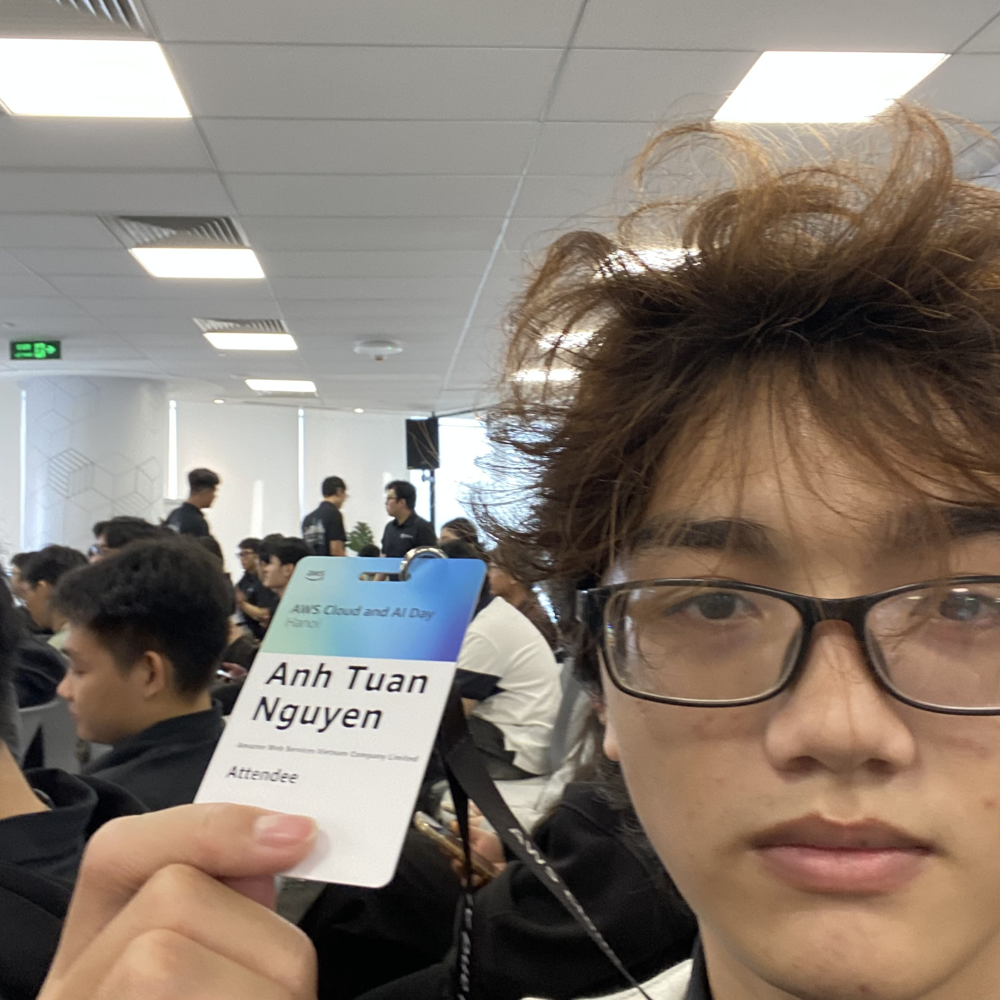

# Bài thu hoạch “AWS Cloud and AI Day Hanoi - Watch Party: Ho Chi Minh City”

### Mục Đích Của Sự Kiện

- Tạo không gian kết nối cho cộng đồng lập trình viên, kỹ sư hạ tầng và lãnh đạo công nghệ tại TP.HCM theo dõi trực tuyến sự kiện lớn nhất trong năm AWS Cloud & AI Day diễn ra tại Hà Nội.
- Cập nhật các xu hướng và chiến lược công nghệ tiên phong từ AWS: Generative AI, Agentic AI, Hiện đại hóa hạ tầng (Modernization) và Quản trị dữ liệu (Data Foundation).
- Thảo luận, trao đổi trực tiếp và mở rộng mạng lưới quan hệ (Networking) giữa các thành viên cộng đồng AWS Builders, Student Builders và các chuyên gia giải pháp tại khu vực phía Nam.

### Danh Sách Diễn Giả

- **AWS Leadership & Technical Speakers** - Các diễn giả chính kết nối trực tiếp từ điểm cầu sự kiện chính tại JW Marriott Hà Nội.
- **AWS Solutions Architects & Community Leaders** - Đội ngũ chuyên gia kỹ thuật AWS phụ trách điều phối và hỗ trợ thảo luận tại văn phòng AWS TP.HCM.
### Nội Dung Nổi Bật

#### Keynote: Định Hướng Tương Lai Với Cloud & AI

- Bức tranh toàn cảnh về làn sóng **Agentic AI** và cách công nghệ này đang định hình lại việc tự động hóa quy trình nghiệp vụ của doanh nghiệp.
- Tầm nhìn của AWS trong việc xây dựng nền tảng đám mây an toàn, linh hoạt và tối ưu chi phí cho các mô hình Generative AI thế hệ mới.

#### Xây Dựng Nền Tảng Dữ Liệu Sẵn Sàng Cho AI (Data Foundation for Agentic AI)

- Tầm quan trọng của dữ liệu doanh nghiệp trong việc huấn luyện và vận hành AI Agent.
- Giới thiệu các năng lực cốt lõi về lưu trữ, quản trị và tích hợp dữ liệu kinh doanh thực tế để AI đưa ra phản hồi chuẩn xác.

#### Ứng Dụng Thực Tế Với Amazon Bedrock & AI Agents

- Kỹ thuật triển khai **AI Agents** thành công trong doanh nghiệp, giúp vượt qua rào cản thử nghiệm (stall pilot) để đưa vào sản xuất (production).
- Sử dụng **Amazon Bedrock** làm nền tảng end-to-end để xây dựng, tùy biến và mở rộng các ứng dụng Generative AI.

#### Tự Động Hóa Phát Triển Và Hiện Đại Hóa Hạ Tầng

- Ứng dụng **Agent Toolkit** và các công cụ AI coding agent trong việc hỗ trợ lập trình viên tra cứu tài liệu và truy cập tài nguyên AWS.
- Chiến lược chuyển đổi các hệ thống kế thừa (legacy systems), giảm nợ kỹ thuật (technical debt) và hiện đại hóa ứng dụng lên Serverless/Containers.

#### Thảo Luận Bàn Tròn & Networking Tại TP.HCM

- Thảo luận trực tiếp tại điểm cầu TP.HCM về khả năng áp dụng các giải pháp AWS vào thị trường thực tế phía Nam.
- Giao lưu giữa các cộng đồng Student Builders, Developer và IT Leads.

### Những Gì Học Được

#### Tư Duy Thiết Kế & Chiến Lược

- **Data-centric AI strategy:** Bắt đầu xây dựng AI từ việc làm sạch và chuẩn hóa nền tảng dữ liệu nội bộ.
- **Agentic Automation:** Chuyển đổi tư duy từ chatbot tra cứu thông tin sang AI Agent có năng lực tự ra quyết định và thực thi công việc.

#### Kiến Trúc Kỹ Thuật

- Cách kết hợp các dịch vụ dữ liệu AWS để làm giàu tri thức cho mô hình AI.
- Tối ưu hóa SDLC bằng cách tích hợp các AI Assistant và AI Agent vào quy trình viết code, testing và bảo trì hệ thống.

#### Ứng Dụng Vào Công Việc

- **Đánh giá lại chiến lược dữ liệu:** Rà soát hệ thống dữ liệu hiện tại của dự án để chuẩn bị cho việc tích hợp AI Agents.
- **Thử nghiệm Amazon Bedrock:** Đăng ký và tạo thử các PoC (Proof of Concept) cho ứng dụng Generative AI.
- **Đẩy mạnh kết nối cộng đồng:** Tham gia sâu hơn vào các hoạt động của AWS User Group/Student Builders tại TP.HCM để học hỏi kinh nghiệm thực chiến.

### Trải nghiệm trong event

Tham gia sự kiện **AWS Cloud and AI Day Hanoi - Watch Party tại văn phòng AWS TP.HCM** là một trải nghiệm kết hợp tuyệt vời giữa việc tiếp thu kiến thức quy mô lớn và không khí kết nối ấm cúng. Một số trải nghiệm nổi bật:

#### Không khí xem livestream tập trung và tương tác cao
- Dù theo dõi qua màn hình từ điểm cầu Hà Nội, không khí tại văn phòng AWS TP.HCM vẫn rất sôi động nhờ sự điều phối của đội ngũ host.
- Các đoạn phức tạp trong phiên Keynote hay Technical sessions được các chuyên gia tại chỗ giải thích và làm rõ ngay trong giờ giải lao.

#### Cơ hội Networking chất lượng tại khu vực phía Nam
- Điểm cầu Watch Party quy tụ nhiều anh chị Cloud Architect, Tech Lead cũng như các bạn sinh viên tài năng tại TP.HCM.
- Dễ dàng trao đổi các bài toán thực tế mà doanh nghiệp phía Nam đang gặp phải khi triển khai Cloud & AI.

#### Bài học rút ra
- Sự kiện Watch Party là mô hình rất hiệu quả để cập nhật công nghệ mới nhất mà không cần phải di chuyển xa.
- **Agentic AI** và **Data Foundation** là hai trụ cột chính mà bất kỳ kỹ sư Cloud/AI nào cũng cần tập trung trau dồi trong thời gian tới.

#### Một số hình ảnh khi tham gia sự kiện

> Tổng thể, sự kiện không chỉ cung cấp kiến thức kỹ thuật mà còn giúp tôi thay đổi cách tư duy về thiết kế ứng dụng, hiện đại hóa hệ thống và phối hợp hiệu quả hơn giữa các team.
