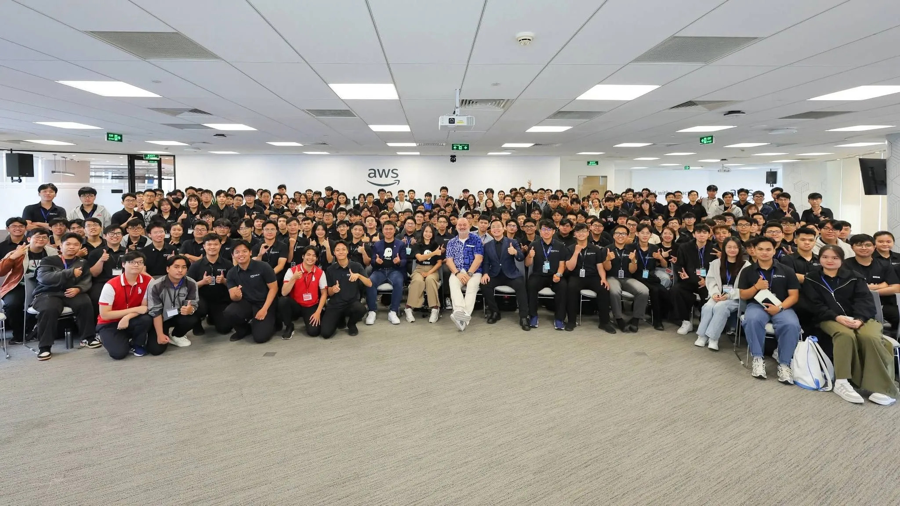

# Summary Report: “Fireside Chat with Dr. Werner”

### Event Objectives

- Experience a keynote address and fireside chat with **Dr. Werner Vogels** — Vice President and Chief Technology Officer (CTO) of Amazon.
- Address a pivotal question regarding the future of the software industry in the AI ​​era: Will artificial intelligence replace software engineers?
- Gain insights into building large-scale infrastructure, operational excellence, and distributed systems design, drawn from over 20 years of developing Amazon and AWS.
- Define the profile of the next-generation programmer—the "**Renaissance Developer**"—equipped to adapt to the wave of Generative AI.

### Speaker

- **Dr. Werner Vogels** - Vice President & Chief Technology Officer (CTO), Amazon.

### Key Highlights

#### The Million-Dollar Outage & The Birth of Core Technology (DynamoDB)

- **Lessons from an overload incident:** Decades ago, during the year's peak shopping day (December 12), Amazon's relational database system (RAC) became overloaded and crashed completely for a full day, resulting in millions of dollars in losses.
- **Real-world behavior analysis:** Amazon discovered that 70% of data queries were simple Key-Value operations (such as retrieving a shopping cart), 20% involved single tables, and only 10% actually required an RDBMS.
- **Homegrown technology:** Relying on off-the-shelf commercial software solutions posed significant risks when operating at hyperscale. This lesson drove Amazon to develop its own proprietary key-value database—the precursor to today's **Dynamo** and **DynamoDB**.

#### 4 Pillars of Operational Excellence

- **Measuring at the 99.9th Percentile (P99.9):** Avoid using medians, as they overlook the worst user experiences. Optimization must target the P99.9 level to elevate the entire performance profile.
- **"Everything Fails All the Time" Philosophy:** Architect systems to withstand the failure of one or two data centers without service disruption.
- **"GameDays" Culture:** Proactively disconnect live production data centers to drill and validate automated failover capabilities and data synchronization.
- **Inverting the IT Economic Model:** AWS pioneered the "Pay-as-you-go" model, compelling cloud providers to continuously deliver superior service to retain customers.

#### The Profile of a "Renaissance Developer"

To avoid being replaced by AI, developers must cultivate five core qualities:

- **Curiosity & Eagerness to Learn:** Continuous learning is a lifelong commitment, given the ever-changing landscape of languages ​​and frameworks.
- **Systems Thinking:** The ability to grasp the big picture of how microservices interact at scale, rather than focusing solely on isolated modules.
- **Ownership:** AI can generate code, but humans remain responsible for production bugs, security vulnerabilities, and architectural integrity.
- **T-Shaped Expertise:** Deepening expertise in one specific area while maintaining broad knowledge across related domains (UI, business logic, databases).
- **Communication Skills:** The ability to distill real-world business problems from trend-driven technical requirements and explain technical trade-offs to stakeholders.

#### AI as a Catalyst – Humans as the Unchanging Core

- AI accelerates the prototyping cycle from weeks to hours, acting as a "natural language compiler."
- However, AI outputs still require human review regarding security, edge cases, and performance.
- While AI automates repetitive tasks, **human judgment, creativity, empathy, and professional pride** remain irreplaceable.

### Key Takeaways

#### Technical & Operational Mindset

- **Look beyond averages:** Optimize systems at the P99 or P99.9 level to ensure a positive experience for every customer.
- **Design for failure:** Build systems with the assumption that any hardware or network component could fail at any moment.
- **Understand data fundamentals:** Analyze data retrieval needs accurately to select the right tool (e.g., Key-Value vs. Relational) and avoid wasting resources.

#### Personal Development

- **Overcoming the fear of AI:** AI will not replace humans; however, those who know how to use AI and possess a systems-thinking mindset will replace those who do not.
- **Embracing Admiral Grace Hopper’s quote:** "The most dangerous phrase in the language is, 'We’ve always done it this way.'"

#### Workplace Application

- **Implementing P99.9 Latency:** Adjusting the monitoring approach for current projects by focusing on high-percentile metrics.
- **Integrating AI as an Assistant:** Leveraging AI to generate boilerplate code and rapid prototypes, while dedicating more time to security reviews, edge cases, and architectural design.
- **Cultivating a T-shaped mindset:** Proactively acquiring knowledge regarding the business domain and adjacent technical layers to communicate more effectively with stakeholders.

### Event Experience

Hearing directly from Dr. Werner Vogels—a titan in the fields of cloud computing and distributed systems—was a deeply inspiring experience:

#### Candor and a practical vision
- Hearing firsthand the "hard-learned lessons" from Amazon's multi-million-dollar website outage years ago gave me a profound understanding of the origins of modern cloud services like DynamoDB.
- Werner’s approach to dispelling fears about AI was compelling: he did not deny AI's power but positioned it correctly as a supporting tool, emphasizing that true capability lies in architectural mindset and an engineer's professional integrity.

#### A realistic perspective on software development
The session helped move beyond the "just write code" mentality. To advance, an engineer must evolve into a **Renaissance Developer**—someone capable of bridging the gap between technology and business value.

#### Key Takeaways
Technologies, programming languages, and AI tools will inevitably change over time. The only enduring elements are **Systems Thinking**, **Operational Discipline**, and the **capacity for continuous self-learning**.

#### Photos from the event

> Overall, the event not only provided technical knowledge but also helped me reshape my thinking about application design, system modernization, and cross-team collaboration.
