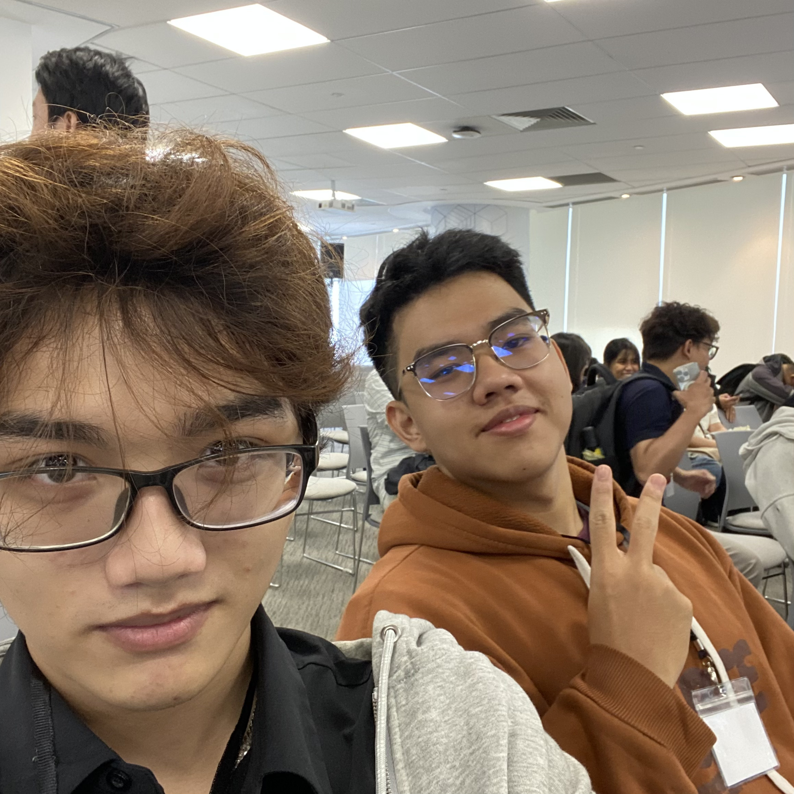

# Bài thu hoạch “Fireside Chat with Dr. Werner”

### Mục Đích Của Sự Kiện

- Trải nghiệm bài phát biểu cốt lõi (Keynote) và phiên trò chuyện (Fireside Chat) cùng **Dr. Werner Vogels** — Phó Chủ tịch kiêm Giám đốc Công nghệ (CTO) của Amazon.
- Trả lời câu hỏi cốt lõi về tương lai ngành phần mềm trong kỷ nguyên AI: Liệu trí tuệ nhân tạo có thay thế các kỹ sư lập trình?
- Học hỏi các bài học kinh nghiệm trong xây dựng hạ tầng quy mô lớn, kỷ luật vận hành (operational excellence) và tư duy thiết kế hệ thống phân tán qua hơn 20 năm phát triển Amazon & AWS.
- Định hình chân dung của người lập trình viên thế hệ mới — "**Renaissance Developer**" (Nhà phát triển thời kỳ Phục hưng) để thích ứng với làn sóng Generative AI.

### Danh Sách Diễn Giả

- **Dr. Werner Vogels** - Vice President & Chief Technology Officer (CTO), Amazon.

### Nội Dung Nổi Bật

#### Sự Cố Triệu Đô & Sự Ra Đời Của Công Nghệ Cốt Lõi (DynamoDB)

- **Bài học từ sự cố quá tải:** Vài thập kỷ trước, vào ngày mua sắm cao điểm nhất năm (12/12), hệ thống cơ sở dữ liệu quan hệ (RAC) của Amazon bị quá tải và sập hoàn toàn trong 1 ngày, gây thiệt hại hàng triệu USD.
- **Phân tích hành vi thực tế:** Amazon phát hiện 70% truy vấn dữ liệu chỉ là dạng Key-Value đơn giản (như lấy giỏ hàng), 20% là bảng đơn lẻ và chỉ 10% thực sự cần đến RDBMS.
- **Tự phát triển công nghệ (Homegrown tech):** Việc phụ thuộc vào các giải pháp phần mềm thương mại có sẵn (off-the-shelf) là rủi ro lớn khi vận hành ở quy mô siêu lớn. Bài học này đã thúc đẩy Amazon tự phát triển cơ sở dữ liệu Key-Value riêng, tiền thân của **Dynamo** và **DynamoDB** ngày nay.

#### 4 Trụ Cột Kỷ Luật Vận Hành (Operational Excellence)
- **Đo lường ở Percentile 99.9 (P99.9):** Không dùng chỉ số trung bình (median) vì nó bỏ qua trải nghiệm tệ nhất của người dùng. Phải tối ưu hóa ở P99.9 để nâng toàn bộ biểu đồ hiệu năng.
- **Triết lý "Everything Fails All the Time":** Thiết kế kiến trúc luôn sẵn sàng chịu đựng việc sập 1-2 trung tâm dữ liệu mà không làm gián đoạn dịch vụ.
- **Văn hóa "GameDays":** Chủ động ngắt kết nối các trung tâm dữ liệu đang chạy thực tế (production) để diễn tập khả năng tự động chuyển vùng (failover) và đồng bộ dữ liệu.
- **Đảo ngược mô hình kinh tế IT:** AWS tiên phong mô hình Pay-as-you-go (dùng bao nhiêu trả bấy nhiêu), tạo áp lực để nhà cung cấp Cloud phải liên tục mang lại dịch vụ tốt nhất mỗi ngày nhằm giữ chân khách hàng.

#### Chân Dung "Renaissance Developer" (Nhà Phát Triển Thời Kỳ Phục Hưng)
Để không bị AI thay thế, lập trình viên cần rèn luyện 5 phẩm chất cốt lõi:

- **Hiếu học & Tò mò (Curiosity):** Học tập liên tục là cam kết suốt đời do ngôn ngữ và framework luôn thay đổi.
- **Tư duy Hệ thống (Systems Thinking):** Nhìn được bức tranh tổng thể về cách các microservices tương tác ở quy mô lớn, thay vì chỉ tập trung vào một mô-đun cô lập.
- **Tinh thần Trách nhiệm (Ownership):** AI có thể tạo ra code, nhưng con người mới là bên chịu trách nhiệm cho bug production, lỗ hổng bảo mật và tính toàn vẹn của kiến trúc.
- **Chuyên môn hình chữ T (T-Shaped Expertise):** Đào sâu một lĩnh vực chuyên môn nhưng duy trì kiến thức rộng ở các mảng lân cận (UI, business logic, DB).
- **Kỹ năng Giao tiếp (Communication Skills):** Giúp bóc tách bài toán kinh doanh thực tế sau những yêu cầu công nghệ chạy theo xu hướng, đồng thời giải thích sự đánh đổi kỹ thuật (technical trade-offs) cho các bên liên quan.

#### AI Là Chất Xúc Tác – Con Người Là Lõi Không Thay Đổi

- AI giúp rút ngắn chu kỳ tạo bản mẫu (prototyping) từ nhiều tuần xuống vài giờ, đóng vai trò như một "trình biên dịch bằng ngôn ngữ tự nhiên".
- Tuy nhiên, kết quả từ AI vẫn cần con người đánh giá lại về tính bảo mật, các trường hợp biên (edge cases) và hiệu năng.
- AI tự động hóa các tác vụ lặp đi lặp lại, nhưng **sự phán đoán, sáng tạo, sự thấu cảm và lòng tự trọng nghề nghiệp** của con người là không thể thay thế.

### Những Gì Học Được

#### Tư Duy Kỹ Thuật & Vận Hành

- **Không tin vào chỉ số trung bình:** Tối ưu hóa hệ thống ở mức P99 hay P99.9 để đảm bảo mọi khách hàng đều có trải nghiệm tốt.
- **Thiết kế cho sự thất bại:** Xây dựng hệ thống với giả định mọi thành phần phần cứng/mạng đều có thể hỏng bất kỳ lúc nào.
- **Hiểu rõ bản chất dữ liệu:** Phân tích đúng nhu cầu truy xuất dữ liệu để chọn đúng công cụ (Key-Value vs Relational) thay vì lãng phí tài nguyên.

#### Phát Triển Bản Thân

- **Vượt qua tâm lý sợ AI:** AI không thay thế con người, nhưng người biết sử dụng AI và có tư duy hệ thống sẽ thay thế người không biết.
- Thấu hiểu trích dẫn của Đề đốc Grace Hopper: "Cụm từ nguy hiểm nhất trong ngôn ngữ là 'Chúng ta vẫn luôn làm theo cách này'".

#### Ứng Dụng Vào Công Việc

- **Áp dụng P99.9 Latency:** Thay đổi cách giám sát (monitoring) các dự án hiện tại, chú trọng các chỉ số Percentile cao.
- **Tích hợp AI làm Assistant:** Sử dụng AI để viết boilerplate code và prototype nhanh, nhưng dành nhiều thời gian hơn cho việc review security, edge cases và thiết kế kiến trúc.
- **Nâng cao tư duy T-shaped:** Chủ động học thêm kiến thức về bài toán kinh doanh (business domain) và các tầng kỹ thuật lân cận để giao tiếp hiệu quả hơn với stakeholder.

### Trải Nghiệm Trong Event

Được trực tiếp lắng nghe chia sẻ từ Dr. Werner Vogels — một tượng đài của ngành Cloud và hệ thống phân tán — là một trải nghiệm truyền cảm hứng mạnh mẽ:

#### Sự thẳng thắn và tầm nhìn thực chiến
- Tận mắt nghe những câu chuyện "xương máu" từ sự cố sập web triệu đô của Amazon ngày trước giúp tôi hiểu sâu sắc lý do đằng sau sự ra đời của các dịch vụ Cloud như DynamoDB ngày nay.
- Cách Werner tháo gỡ nỗi sợ hãi về AI rất thuyết phục: ông không phủ nhận sức mạnh của AI nhưng đặt nó đúng vị trí là công cụ hỗ trợ, còn bản lĩnh nằm ở tư duy kiến trúc và lòng tự trọng nghề nghiệp của engineer.

#### Góc nhìn thực tế về nghề phát triển phần mềm
Phiên trò chuyện giúp xóa bỏ tư duy "chỉ biết gõ code". Để tiến xa, một engineer cần biến mình thành **Renaissance Developer** — biết kết nối giữa công nghệ và giá trị kinh doanh.

#### Key Takeaways
Công nghệ, ngôn ngữ lập trình hay công cụ AI sẽ luôn thay đổi theo thời gian. Thứ bền vững duy nhất chính là **Tư duy hệ thống (Systems Thinking)**, **Kỷ luật vận hành** và **Khả năng tự học liên tục**.

#### Một số hình ảnh khi tham gia sự kiện

> Tổng thể, sự kiện không chỉ cung cấp kiến thức kỹ thuật mà còn giúp tôi thay đổi cách tư duy về thiết kế ứng dụng, hiện đại hóa hệ thống và phối hợp hiệu quả hơn giữa các team.